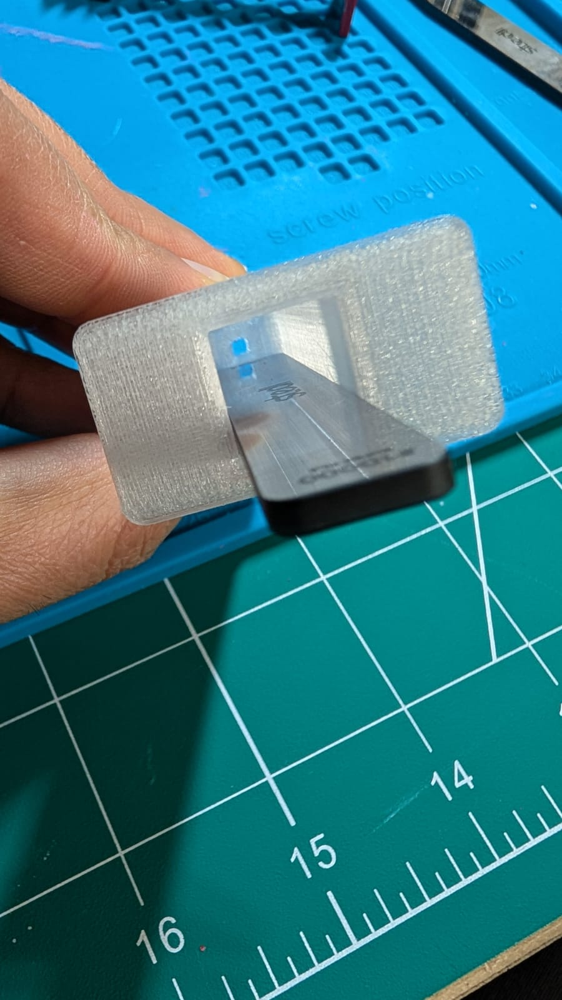

# Square Syringe

This repository contains 3D printable models for a square syringe consisting of a square barrel and a corresponding square plunger. The unique square geometry enables precise control over plunger movement and eliminates rotational movement typical of cylindrical syringes.

## Design Overview

The square syringe design consists of two primary components:

- **Square Barrel**: A square cross-section cylindrical container with a tapered dispensing tip
- **Square Plunger**: A precisely matched square plunger with thin side walls designed for smooth operation within the barrel

## Printing Instructions

### Recommended Print Settings

| Parameter                | Recommended Value(s)          |
|-----------------------|-----------------------------|
| Layer Height        | 0.08 mm or 0.12 mm         |
| Material - Barrel | PETG                       |
| Material - Plunger| PLA                       |
| Print Speed       | 30-40 mm/s                 |
| Nozzle Temperature| Material-specific         |
| Supports Required| None                      |

### Printing Recommendations

1. **No supports are required** for either the barrel or plunger due to the self-supporting geometry.

2. **Critical Print Parameters**:

| Component | Key Considerations
| -------- | ---------------|
| Barrel | Print with maximum wall thickness (4-5 walls) to ensure structural integrity and smooth internal surfaces
| Plunger| Print with maximum wall thickness (4-5 walls) to maintain precise dimensional accuracy of the thin side walls

## Post-Processing Procedure

The plunger side walls are intentionally printed at 0.05 mm thickness to achieve optimal sealing while maintaining smooth operation. Post-processing is required to achieve the necessary surface finish.

The primary post-processing step involves smoothing the plunger side walls using a laser-etched glass file:

- Use a laser-etched glass file specifically on the **plunger side walls only**
- Make multiple light passes over the entire surface of each plunger wall
- Focus on removing visible layer lines and creating a uniform, smooth surface

If minor roughness is present on the internal surfaces of the barrel, the same glass file can be used to lightly smooth these surfaces.

### Required Post-Processing Steps

| Step                          | Purpose
| ---------------------------| ----|
| Laser-etched glass file | Smooth the 0.05 mm thick plunger side walls and remove layer lines
| Multiple passes (3-5)  | Progressively refine surface finish and ensure compatibility with barrel internal surfaces

Recommended laser-etched glass files can be found here: [Glass File 1](https://s.click.aliexpress.com/e/_m0XoUnr) and [Glass File 2](https://s.click.aliexpress.com/e/_mMr4UdT).

Additional reference for the filing technique: [Instagram demonstration](https://www.instagram.com/reel/DQ77J7dAV2H/?utm_source=ig_web_copy_link&igsh=MzRlODBiNWFlZA==)

### Verification

After filing, the plunger should move smoothly within the barrel without binding. Minor resistance is acceptable and desirable for proper sealing.

## Assembly and Operation

1. Insert the post-processed plunger into the barrel
2. The tight fit of the 0.05 mm thick plunger walls provides sealing without the need for additional o-rings or lubricants
3. The square geometry prevents rotational movement, providing precise control over plunger positioning

## Design Considerations

- The 0.05 mm wall thickness of the plunger sides represents an optimal balance between sealing performance and manufacturability
- The square cross-section eliminates the need for rotational alignment and provides uniform pressure distribution across all four walls
- The absence of internal overhangs eliminates the need for support material, simplifying the printing process

## Troubleshooting

| Issue                          | Solution
|------------------------------| -----|
| Plunger binds during insertion | Additional light filing with laser-etched glass file on plunger walls
| Excessive plunger movement  | Verify that post-processing has not removed excessive material from plunger walls
| Poor sealing performance  | Ensure plunger walls maintain their 0.05 mm thickness after filing

## File Structure

- `Barrel.step` - Complete square syringe barrel with integrated dispensing tip
- `Plunger.step` - Square plunger with 0.05 mm thick side walls

## Notes

- The dimensional precision of the plunger walls is critical to the performance of the syringe. Excessive material removal during post-processing will compromise the seal.
- The recommended layer heights of 0.08 mm or 0.12 mm provide the optimal balance between surface quality and print time.
- PETG is recommended for the barrel due to its superior layer adhesion and chemical resistance, while PLA is preferred for the plunger to facilitate the precise post-processing required.

## License

This project is provided under the Creative Commons Attribution-NonCommercial-ShareAlike 4.0 International License. See the LICENSE file for details.
